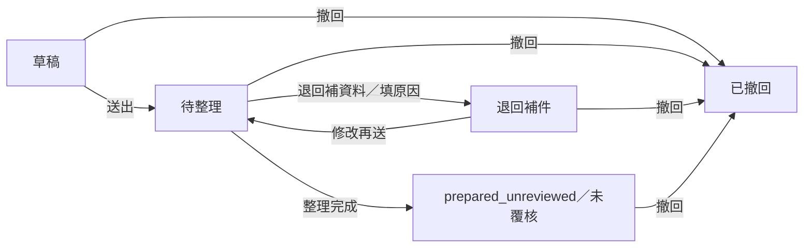

# 行政工作台：店家與中小企業模擬試用

[開啟行政工作台](https://freedom-erp-crm-demo.digimkt.workers.dev/#administration)。先建立任一工作區；一般企業範本 v2 預設加入行政，其他範本及既有工作區可從左側「行政工作台」明確啟用。啟用只增加空的行政資料，保留原商品、客戶、錢包、流水、generation 與教學紀錄。

這是可實際儲存的單訪客 SIM 工具，資料仍以原工作區的同源、CSRF、版本與冪等流程保護。每位訪客有自己的資料；沒有企業團隊登入、真人員工權限、第二人獨立覆核、正式出勤、薪資或政府連線。請只填假員工代稱、合成內容與測試幣估額。

## 建立第一組行政資料

1. 在「組織」建立門市／辦公室據點，必要時再建立所屬部門。
2. 在「假員工」填代號、代稱、所屬單位及職務說明。代號與單位建立後固定，名稱及使用狀態可調整；職務文字不是登入角色。
3. 在「週班表」建立班次，或在「手動出勤」填合成時間與休息分鐘。兩種紀錄分開，不會因結束班次就自動產生出勤。
4. 依需要建立申請、設備借用及公告；畫面會顯示來源、待整理項目與真實儲存狀態。

## 每個分頁與主要操作

| 分頁 | 已可操作的內容 | 檢查與結果 |
| --- | --- | --- |
| 組織 | 新增據點／部門、修改名稱、啟用／停用、按組織篩選 | 上層引用不得循環；有使用中的子單位、人員、班次或設備時，不能直接停用 |
| 假員工 | 新增代號與代稱、改代稱／職務、停用／恢復、搜尋 | 同工作區代號唯一；既有身份引用保留，有未結束班次／借用不能直接停用 |
| 週班表 | 七日班表、跨夜時間、週切換、新增／取消／結束班次、複製整週 | 同人時段重疊拒絕；複製遇一筆衝突則整批不寫入，不會先存一部分 |
| 手動出勤 | 新增合成出勤、填休息分鐘、查看與排班的分鐘差異 | 與排班分開檢查；同人出勤重疊拒絕，沒有真打卡或核定出勤 |
| 申請 | 請假、請購、費用估額、一般事項；草稿修改、送出、退回補資料、撤回、整理完成 | 整理結果固定「未覆核」，不核准請假、不扣幣、不建立總帳、發薪或付款 |
| 設備 | 新增代號／名稱、修改、維修、停用、查看借用 | 有預約中的設備不能改成維修／停用；資料不是財務固定資產或折舊帳 |
| 借用 | 預約設備、歸還、取消、按人員／設備搜尋 | 同設備有效預約不能重疊；歸還後可再預約，保留原紀錄 |
| 公告 | 新增／修改合成公告、置頂、期限、組織範圍、文字搜尋 | 公告只屬這位訪客的工作區，不傳送 Email、簡訊或對外通知 |

申請會保留最多 50 筆狀態變更及每次退回原因，重送後不清除最新原因；這是這位訪客的操作紀錄，不是第二人簽核證據。

各表單先檢查必要資料，確認後才寫入；取消不寫入。伺服器拒絕時會保留可修改的表單，未確認的操作依原收據重試，不以新操作代號假造成功。

## 時間、複製與統計

畫面使用臺北日期時間，儲存為帶時區的 ISO 時間，精度為分鐘。排班與出勤每段最多 48 小時，請假期間與設備借用最多 31 日；這是此模擬工具的輸入上限，並非法律准許的工時或假期。

時段採半開區間，前一段結束時間與下一段開始相同可接續。休息分鐘須小於整段時間。週班表與差異表依各段開始日歸週，跨夜分鐘完整計入，不在週界線分攤休息分鐘；因此不是薪資結算報表。沒有法定休假餘額或加班費計算。

整週複製以不同的兩個星期一為來源與目的，採臺北民用週，保留原人員、單位、時段及休息分鐘並建立新的排定班次。已取消班次不複製；來源空、目標衝突、來源人員停用或超出容量時整批拒絕。

行政摘要只反映已儲存資料：啟用單位、使用中的假員工、尚未標記完成的班次、手動淨分鐘、待整理申請、整理完成但未覆核項目、可借設備、預約與置頂公告。錢包守恆、FIFO 與舊模擬報表仍獨立保留，費用估額不是實支、營收、薪資或利潤。

## 申請狀態

`prepared_unreviewed` 不等於 `approved`。單訪客自己整理文件不會被當成第二人簽核，這輪沒有核准、准假、撥款、發薪、報稅或開立正式發票操作。

## 保存與相容

行政資料放在 `workspace.administration`，版本為 `freedom-administration-v1`。舊 schemaVersion 1 工作區未啟用行政仍可使用；啟用後納入嚴格欄位、UUID、引用、狀態、時段與匯入驗證，未知欄位或跨集合識別衝突會拒絕。沒有改名繞過銀行／正式財務拒絕條件。

單位最多 50 筆；假員工、申請、設備、公告各 100 筆；班次、出勤、借用各 200 筆。工作區仍受原 JSON 字串長度、500 筆歷史／收據等配額限制。匯入請求封裝仍最多 32,768 bytes；較大的匯出不保證能以此上限還原。

公開工作區在 72 小時沒有活動後清除，清除 cookie 會換工作區。自架仍是 SIM；同一資料資料夾與瀏覽器可接續，請保留設定並定期匯出。舊一般企業 CLI 預設七模組的實例，請用原下載 JSON 或明確列出原 modules 重啟；新版一般企業預設八模組，既有不同設定不覆寫。

完整企業身份、分層權限、獨立審核、法律政策與正式人資／財務仍見[企業規格](../spec/spec-design-enterprise-suite.md)及[P0–P6 計畫](../plan/design-enterprise-suite-v1.md)；本輪行政試用的建置及驗收見[行政試用計畫](../plan/feature-administration-pilot-v1.md)。
