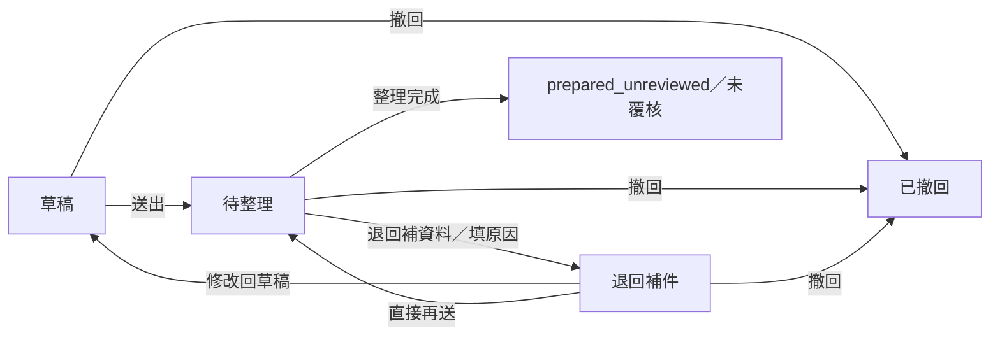

# 行政工作台：店家與中小企業模擬試用

[開啟行政工作台](https://freedom-erp-crm-demo.digimkt.workers.dev/#administration)。先建立任一工作區；一般企業範本 v2 預設加入行政，其他範本及既有工作區可從左側「行政工作台」明確啟用。啟用只增加空的行政資料，保留原商品、客戶、錢包、流水、generation 與教學紀錄。

這是可實際儲存的單訪客 SIM 工具，資料仍以原工作區的同源、CSRF、版本與冪等流程保護。每位訪客有自己的資料；沒有企業團隊登入、真人員工權限、第二人獨立覆核、正式出勤、薪資或政府連線。請只填假員工代稱、合成內容與測試幣估額。

## 建立第一組行政資料

畫面的三步入門可直接帶到對應表單：

1. 建立組織：新增門市／辦公室據點，必要時再建立所屬部門。
2. 加入假員工：填代號、代稱、所屬單位及職務說明。代號與單位建立後固定，代稱及使用狀態可調整；職務文字不會取得登入權限。
3. 排第一個班次：選假員工並填時段、休息分鐘。再到「手動出勤」輸入合成出勤；兩種紀錄分開，結束班次不會自動產生出勤。

想先練習完整流程，可在全空的行政桌按「建立合成示範」，選擇店家、辦公室或工廠，再選臺北日期的星期一。一次會建立 1 個單位、2 位假員工、5 個平日班次、2 筆人工輸入的合成出勤、1 份請購草稿、1 件設備、1 筆借用及 2 則公告。代稱、內容與估額都標示為合成示範，請購維持草稿，不會變動原商品、客戶、錢包或流水。

示範只可加入八類行政資料及更正紀錄都為空的行政桌。已有資料時請接續操作，不能用示範覆寫；作廢或封存的保留紀錄也算已有資料。

## 每個分頁與主要操作

| 分頁 | 已可操作的內容 | 檢查與結果 |
| --- | --- | --- |
| 組織 | 新增據點／部門、修改名稱、啟用／停用、按組織篩選 | 上層引用不得循環；有使用中的子單位、人員、班次或設備時，不能直接停用 |
| 假員工 | 新增代號與代稱、改代稱／職務、停用／恢復、搜尋 | 同工作區代號唯一；既有身份引用保留，有未結束班次／借用不能直接停用 |
| 週班表 | 七日班表、跨夜時間、週切換、新增、附理由更正時段、取消／結束班次、複製整週 | 只有排定中的班次可更正；同人時段重疊拒絕，尚未到結束時間不能標記完成；複製遇一筆衝突則整批不寫入 |
| 手動出勤 | 新增合成出勤、填休息分鐘、附理由更正／作廢、查看與排班的分鐘差異 | 與排班分開檢查；同人有效出勤不能重疊，作廢後保留原紀錄，不計工時也不阻擋新增正確紀錄 |
| 申請 | 請假、請購、費用估額、一般事項；草稿修改、送出、退回補資料、撤回、整理完成 | 整理結果固定「未覆核」，不核准請假、不扣幣、不建立總帳、發薪或付款 |
| 設備 | 新增代號／名稱、修改、維修、停用、查看借用 | 有預約中的設備不能改成維修／停用；資料不是財務固定資產或折舊帳 |
| 借用 | 預約設備、附理由改期／改用途、歸還、取消、按人員／設備搜尋 | 只有預約中的紀錄可更正，設備與假員工固定；同設備有效預約不能重疊，歸還後可再預約，原紀錄保留 |
| 公告 | 新增／修改合成公告、置頂、期限、組織範圍、搜尋、封存／還原 | 封存後保留內容及紀錄，可切換到封存清單還原；封存公告不列入最近截止或置頂統計，不傳送 Email、簡訊或對外通知 |

申請會保留最多 50 筆狀態變更及每次退回原因，重送後不清除最新原因；這是這位訪客的操作紀錄，不是第二人簽核證據。

各表單先檢查必要資料，確認後才寫入；取消不寫入。伺服器拒絕時會保留可修改的表單，未確認的操作依原收據重試，不以新操作代號假造成功。

## 更正、作廢與保留紀錄

班次、有效出勤及預約更正時，至少要改一個時段、休息分鐘或內容，並填寫理由。更正保留原單位、假員工及設備引用；新時段仍須符合上限與重疊檢查。衝突或驗證失敗時，原紀錄與更正歷程都不變。

在紀錄卡片展開「更正與保留紀錄」，可核對原值、新值、理由與臺北時間。班次更正、出勤更正／作廢、預約更正、公告封存／還原共用最多 200 筆 `changes` 紀錄；達到上限後會拒絕新增更正紀錄，不會自動刪掉較舊的原因。公告封存與還原的原因由系統記錄。

作廢出勤保留原段時間與原因，停止計入有效分鐘，也不再占用同人的時段。原作廢紀錄不能再修改或重複作廢，請另建一筆正確出勤。已完成／取消班次及已歸還／取消預約也保留原資料，各自的更正操作只接受尚在排定或預約中的狀態。

這些紀錄供單訪客回看自己的操作，沒有另一位覆核人或正式簽核身份。

## 時間、複製與統計

畫面使用臺北日期時間，儲存為帶時區的 ISO 時間，精度為分鐘。排班與出勤每段最多 48 小時，請假期間與設備借用最多 31 日；這是此模擬工具的輸入上限，並非法律准許的工時或假期。

時段採半開區間，前一段結束時間與下一段開始相同可接續。休息分鐘須小於整段時間。週班表與差異表依各段開始日歸週，跨夜分鐘完整計入，不在週界線分攤休息分鐘；因此不是薪資結算報表。沒有法定休假餘額或加班費計算。

整週複製以不同的兩個星期一為來源與目的，採臺北民用週，保留原人員、單位、時段及休息分鐘並建立新的排定班次。已取消班次不複製；來源空、目標衝突、來源人員停用或超出容量時整批拒絕。

行政摘要只反映已儲存資料：啟用單位、使用中的假員工、尚未標記完成的班次、有效手動淨分鐘、待整理申請、整理完成但未覆核項目、可借設備、預約與發布中的置頂公告。作廢出勤不計入淨分鐘，封存公告不計入置頂。錢包守恆、FIFO 與舊模擬報表仍獨立保留，費用估額不是實支、營收、薪資或利潤。

## 篩選、CSV 與列印

先選分頁，再設定組織、搜尋、狀態及日期範圍，按「匯出目前範圍 CSV」或「列印目前範圍」。排班與出勤按所選週及各段開始日歸週，其他分頁使用其畫面顯示的日期範圍；輸出只包含目前篩選結果，不會把整份工作區當成同一張報表。

CSV 與列印標示 SIM、工作區名稱及版本、組織範圍、搜尋與狀態條件、日期範圍、臺北時區、產出時間及資料來源。「更正與保留紀錄」欄會列出時間、原因及畫面所列欄位的原值／新值，完整快照保存在 JSON 備份。CSV 會處理引號與換行；遇到可能被試算表當成公式的 `=`、`+`、`-`、`@` 等前綴時，以文字輸出。

出勤預設顯示有效紀錄，公告預設顯示發布中。若改選作廢、封存或全部狀態，輸出會包含選到的保留紀錄；作廢出勤的有效分鐘仍為 0，取消班次也不計入有效分鐘。這些輸出供 SIM 流程核對，不作薪資、法定工時或正式核准文件。

## 申請狀態

退回後修改會回到草稿，也可直接再送；最新退回原因及每次退回歷程都保留。`prepared_unreviewed` 為本輪整理流程的終止狀態，不能再撤回或送出，也不等於 `approved`。單訪客自己整理文件不會被當成第二人簽核，這輪沒有核准、准假、撥款、發薪、報稅或開立正式發票操作。

## 保存與相容

行政資料放在 `workspace.administration`，版本為 `freedom-administration-v1`。舊 schemaVersion 1 工作區未啟用行政仍可使用；啟用後納入嚴格欄位、UUID、引用、狀態、時段與匯入驗證，未知欄位或跨集合識別衝突會拒絕。沒有改名繞過銀行／正式財務拒絕條件。

舊 format1 可以沒有 `changes`、出勤的 `voided` 或公告的 `archived`。讀取與驗證不會替舊紀錄補寫；成功執行行政命令後，才在該次儲存加入空更正紀錄、未作廢及未封存的預設值。匯入保留的更正快照也會檢查來源、時間、前後連續性與引用，不把快照中的原紀錄 ID 當成另一筆新資料。

單位最多 50 筆；假員工、申請、設備、公告各 100 筆；班次、出勤、借用各 200 筆；更正與封存紀錄共 200 筆，每份申請狀態紀錄最多 50 筆。工作區 JSON 字串長度仍最多 1,000,000，歷史／收據等原配額也保留；作廢、取消與封存紀錄仍占所屬集合容量。

完整工作區使用「設定與資料」的 SIM JSON 備份。原選檔最多 8 MiB，解析後的精簡 UTF-8 JSON 最多 3 MiB；大檔以 24,000-byte 分段傳輸，每個請求本文仍不超過 32,768 bytes。完整驗證通過後才一次還原，步驟、取消、15 分鐘接續及原操作結果恢復見[備份與還原](backups.md)。CSV 與列印只保存所選範圍，完整還原請使用 JSON。

公開工作區在 72 小時沒有活動後清除，清除 cookie 會換工作區。自架仍是 SIM；同一資料資料夾與瀏覽器可接續，請保留設定並定期匯出。舊一般企業 CLI 預設七模組的實例，請用原下載 JSON 或明確列出原 modules 重啟；新版一般企業預設八模組，既有不同設定不覆寫。

完整企業身份、分層權限、獨立審核、法律政策與正式人資／財務仍見[企業規格](../spec/spec-design-enterprise-suite.md)及[P0–P6 計畫](../plan/design-enterprise-suite-v1.md)；原行政試用見[行政試用計畫](../plan/feature-administration-pilot-v1.md)，本輪更正、報表與備份工作見[SIM 完整流程計畫](../plan/feature-complete-sim-workflows-v1.md)。
