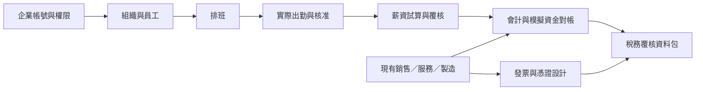

# 企業管理擴充設計

最新可操作範圍：[行政工作台](https://freedom-erp-crm-demo.digimkt.workers.dev/#administration)已提供單訪客行政試用，可儲存組織、假員工、排班、手動出勤、申請、設備借還及公告。這個第八個模組獨立於以下十七個完整企業規劃，沒有把企業身份／薪資／正式金融或獨立簽核宣告完成；詳見[行政操作](../administration.md)。

以台灣小型店家與中小企業為主，保留多分店、工廠及不同政策版本。以下文件是完整企業系統的設計與功能藍圖；新行政試用之外的正式人資、排班制度、薪資、銀行對帳、報稅與發票尚未加入資料引擎，沒有正式連線。原七個模組仍只提供 SIM 流程練習。

**[開啟企業功能藍圖](https://freedom-erp-crm-demo.digimkt.workers.dev/enterprise-plan.html)**。可切換單店／中小企業／多店工廠，查找模組，點選查看用途、資料、操作流程及建置階段。所有未實作項目均標示「規劃中／設計預覽」，點選不會建立資料或執行交易。

| 文件 | 內容 |
| --- | --- |
| [整體規格](../../spec/spec-design-enterprise-suite.md) | 24 個模組的現況／計畫、資料責任、身份與權限、API 候選契約、22 項驗收條件 |
| [人資與排班](workforce-design.md) | 組織、人員、入離職、排班、出勤、休假、薪資結構與敏感資料權限 |
| [財務與稅務](finance-design.md) | 模擬資金對帳、會計、應收應付、薪資費用、稅務資料包與電子發票生命週期 |
| [建置計畫](../../plan/design-enterprise-suite-v1.md) | 每期的依賴、預計程式位置、工作項目與驗收條件；均為 Planned |
| [現有功能](../templates.md) | 可用的七個模組；設計藍圖不會增加一鍵安裝目錄的支援項目 |

## 店家與企業功能安排

| 類別 | 設計範圍 |
| --- | --- |
| 經營與組織 | 法人、分店、部門、職位、成本中心、預算、角色、分層簽核、文件與稽核 |
| 排班與出勤 | 人力需求、班表、換班、跨夜、請假、補卡、加班／補休、差異覆核與期間凍結 |
| 人資 | 招募、假員工資料、僱用條件、入職／異動／離職、訓練、績效、福利與設備交接 |
| 薪資 | 月薪／時薪／計件、基本薪資、津貼、獎金、加班、扣項、保費、扣繳、薪資單及成本歸屬 |
| 資金與會計 | 帳別統計、匯入預覽、去重與對帳、現金預測、應收應付、費用、分錄、月結及報表 |
| 稅務與憑證 | 制度分流、營業稅／所得稅資料包、薪資扣繳、進銷項、發票草稿、作廢／折讓與回執核對 |
| 營運擴充 | 供應商、請購採購、分批收貨、委外、資產／保養／折舊、品質／改善、服務預約及經營分析 |

目前每位匿名訪客有自己的工作區。企業共同使用前，須先完成成員驗證、分店與員工資料範圍、搜尋／報表／匯出權限、遷移及備份。排班計畫不等於實際出勤；薪資試算不等於核定或銀行撥付；下載報稅包不等於申報成功。

勞動、保費、稅務與發票規則採有效日期及來源版本，不能給所有店家套一組費率。官方來源查核日為 2026-10-05，細項見兩份領域設計。SIM 範例與正式 TWD 政策分開，現在只使用假員工、模擬商品及測試金額。設計中的正式候選接口不代表已取得連線或提交授權。

公開試用資料在 72 小時無活動後清除，不可作為正式人事、薪資或憑證保存系統。企業留存、權責與正式接口將在相應階段另行驗收。
