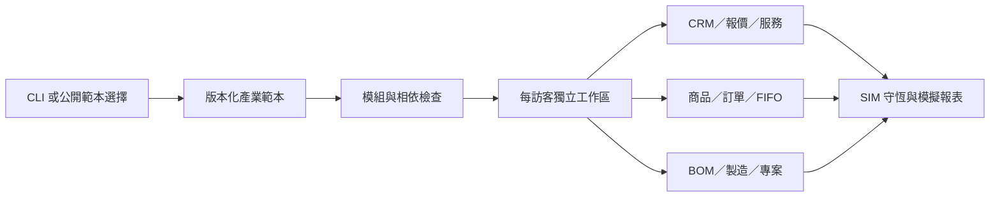

# 產業範本與擴充

範本正本是 `src/templates.ts`。每個範本有 ID、名稱、版本、用途、模組、用語及示範商品／客戶／BOM。共用引擎不依店名猜測業務規則。

可用模組：`crm`、`inventory`、`sales`、`wallets`、`services`、`projects`、`manufacturing`、`administration`。行政為單訪客 SIM 模組，詳見[操作範圍](administration.md)；完整企業人資／薪資／稅務仍在規劃。新增 ID 不會自動產生未實作的功能；請實作命令、伺服器 gate、資料引用與測試後才宣告支援。

一般企業範本 version 2 預設使用八個模組，其他七種產業保留 version 1 的舊預設，可在建置中心勾選行政。舊工作區只在「啟用行政模擬」確認後加入空資料，不自動遷移或覆寫原業務。

相依：sales 需要 inventory／wallets；services 需要 crm／wallets；manufacturing 需要 inventory／wallets。GUI 自動加入相依；CLI 不符合時拒絕，伺服器再次檢查。

例如只練習客戶管理：

```sh
npx --yes github:mars-tw/freedom-erp-crm --industry general --name '客戶流程測試' --modules crm
```

客製步驟：新增範本、定義樣本及用語、補測完整流程，再修改介面。若要加入真實金流、會計、薪資、個資或受規範的產業資料，必須另設責任、權限、留存及整合契約；本專案沒有這些正式能力。


