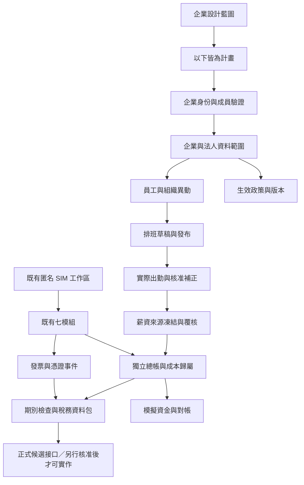

# Introduction

將自由 ERP CRM 的模擬銷售、服務、製造與客戶流程，規劃成可供台灣小型店家及中小企業逐步擴充的管理系統。此文件是設計契約：新增模組均為 Planned，尚未加入資料引擎。可點選的[企業功能藍圖](https://freedom-erp-crm-demo.digimkt.workers.dev/enterprise-plan.html)僅展示設計，不執行排班、發薪、銀行交易、報稅或開立正式發票。

## 1. Purpose & Scope

使用者已選定台灣小型店家／中小企業；預設 Asia/Taipei，保留多分店與工廠的組織層級。人數範圍只作介面設計情境，尚未完成容量承諾。每一功能須有資料來源、權責、狀態、主要操作與驗收條件，不能只新增選單名稱就宣告實作。

本次交付包含整體規格、[人資與排班設計](../docs/enterprise/workforce-design.md)、[財務與稅務設計](../docs/enterprise/finance-design.md)、[分期建置計畫](../plan/design-enterprise-suite-v1.md)及靜態互動藍圖。既有公開試用仍只使用假商品與 SIM，沒有正式財務或真人人事資料連線。

| 使用情境 | 預設設計 | 擴充設計 |
| --- | --- | --- |
| 單店／工作室 | 一法人、一門市、兼職與正職、排班、出勤、薪資試算、費用、模擬對帳 | 外部會計覆核、會員與服務預約、採購補貨 |
| 中小企業 | 法人／部門／職位／成本中心、分層審核、招募到離職、薪資、採購、資產、月結 | 預算、訓練、績效、報表及員工入口 |
| 多分店／工廠 | 分店權限、調店、跨夜班、製造與人力成本、設備維護、品質追蹤 | 合併管理報表、跨法人交易與授權；不自動合併法定帳簿 |

## 2. Definitions

| 名稱 | 定義 |
| --- | --- |
| SIM | 本產品的模擬金額，100 最小單位為 1 SIM；不是新臺幣 |
| Tenant | 經企業成員權限驗證的資料範圍；現行匿名訪客工作區尚不是多人企業 tenant |
| 法人／分店／成本中心 | 法定申報主體／營運位置／費用歸屬；三者不得互相代用 |
| 排班／出勤／薪資 | 預定工作時段／實際紀錄及補正核准／凍結基準後的計算與覆核；不可彼此推定完成 |
| Maker／Checker | 製作人／獨立覆核人；同一自然人不可換角色冒充兩人 |
| GL／AP／AR | 總帳／應付帳款／應收帳款；現行 wallet ledger 不具備正式總帳能力 |
| 對帳 | 核對帳面與外部或模擬明細；不等於付款、營收認列或利潤 |
| Policy bundle | 含版本、適用地區、有效日期、來源與核准人的工時／薪資／稅務規則組合 |
| Receipt | 供應商或機關的查驗回應，包含 correlation、狀態與回執；下載檔案不是申報回執 |
| Planned | 已安排設計，沒有可用的領域命令；介面一律標示「規劃中／設計預覽」 |

## 3. Requirements, Constraints & Guidelines

### 功能與交付狀態

七個現有模組為 `inventory`、`sales`、`wallets`、`services`、`crm`、`projects`、`manufacturing`，僅具有現行 SIM 功能。下列十七個穩定 ID 全為計畫新增，未出現在目前可安裝模組目錄。

| 需求 | 計畫模組 ID | 頁面與主要操作設計 | 關聯與階段 |
| --- | --- | --- | --- |
| REQ-001 | enterprise | 法人、分店、部門、職位、成本中心；建立組織、邀請成員、調整資料範圍、移交權限 | 先完成企業身份與成員路由；P0／P1 |
| REQ-002 | hr | 員工、僱用條件、異動、福利、訓練、績效、離職交接；新增假員工、提報異動、核對交接 | enterprise、approvals、documents；P1 |
| REQ-003 | scheduling | 日／週／月班表、人力需求、可排時段、換班；產生草稿、檢查衝突、送審、發布新版 | hr 與版本化工時政策；P2 |
| REQ-004 | attendance | 簽到、跨夜、漏卡、補卡、休假、加班與補休；申請、覆核、凍結計薪期間 | scheduling 是比較來源，不是實際工時；P2 |
| REQ-005 | payroll | 月薪／時薪／計件、薪資項目、津貼、加班、獎金、扣項、保費、扣繳、薪資單；試算、核對差異、核定、產生模擬清冊 | 核准出勤＋有效薪資契約＋政策快照；P3 |
| REQ-006 | treasury | 多個模擬資金帳、期初、流水、調節、現金預測、薪資／供應商清單；預览匯入、配對、確認差異、取消配對 | 不連銀行、不執行撥款；正式候選接口屬 P6；P4 |
| REQ-007 | accounting | 科目、分錄、AP／AR、費用報銷、預算、月結、試算表；草擬分錄、送審、過帳、沖銷、結帳 | 與 wallet ledger 分開，記錄來源事件與期別；P4 |
| REQ-008 | tax | 營業人制度、稅別、申報期間、薪資扣繳、營業稅、營所稅資料包；核對基礎、檢查缺件、試算、產生覆核包 | 查定／一般等制度分流，輸出 SIM 不是正式申報檔；P5 |
| REQ-009 | invoices | 銷項／進項、買受人類型、憑證關聯、作廢、折讓及回執；草稿檢查、流程預覽、查核回應 | 訂單退貨、資金退回、發票折讓分別記錄；P5 |
| REQ-010 | procurement | 供應商、請購、採購單、收貨、委外、應付；提請購、覆核、分批收貨、核對三方差異 | 應付單與收貨不能推定已付款；P4 |
| REQ-011 | assets | 設備、門市器具、領用／歸還、保養、折舊、報廢；登錄資產、交接、建立保養計畫 | hr／成本中心／accounting；P4 |
| REQ-012 | quality | 來料、製程、出貨檢驗、異常與改善；記錄抽驗、隔離批次、提出改善、覆核結果 | 採購／製造批次與負責人；P4 |
| REQ-013 | approvals | 請假、補卡、採購、薪資與費用的門檻、代理、撤回、退件；送審、覆核、拒絕、改版 | 服務端核權，需與各領域版本一致；P0／P1 |
| REQ-014 | documents | 契約版本、教育訓練、證照、憑證附件、交接與留存；上傳候選資料、核對版本、按權限匯出 | 公開版僅假文件，未實作電子簽章；P1 |
| REQ-015 | analytics | 營運、人力、工時、薪資成本、庫存、資金、對帳、預算與報稅待辦；比較期間、追查來源 | 權限後彙整，不把資金餘額稱為利潤；P4／P5 |
| REQ-016 | recruitment | 職缺、候選人、面談、錄取、入職移轉；記錄假履歷、安排面談、核准錄取 | 不自動作真人錄用決策；拒絕與保存範圍可控；P1 |
| REQ-017 | connectors | 未來銀行、報稅、電子發票、打卡／POS、外部會計與通知候選接口 | P6 設計門檻，現在沒有連線或呼叫權限 |

### 共用條件

- **REQ-018**：規模只改變建議功能與版面，不能改變權限；模組相依須於伺服器驗證。把員工當 CRM 顧客或把財務資訊放進共用 notes 欄位不符合規格。
- **REQ-019**：提供員工本人入口、主管的管理範圍、人資與薪資專用視圖、外部會計期間限定視圖。任一頁的查詢、搜尋、報表、匯出及附件下載皆受同一權限約束。
- **REQ-020**：每個操作保存 actor、tenant、來源版本、有效時間、操作代號及結果；修正以新版本或反向事件留下原因，不改寫已核定結果。
- **REQ-021**：排班衝突、法定工時提示、休假餘額、缺卡、薪資差異、未對帳、待覆核及申報缺件均可定位到原資料；提醒本身不代替核准。
- **REQ-022**：單店操作人不足時顯示 single_operator 與「未完成第二人審核」，本版僅允許草稿及模擬試算，維持 prepared_unreviewed，不能核定薪資或假稱雙人覆核通過。未來低風險、非本人案件的例外政策須另立契約與責任記錄；本人異動、本人薪資行及付款目的地變更不可藉例外自審，也不能以此取得正式送款或申報能力。
- **REQ-023**：一鍵建置先選產業，再選規模、啟用模組與設定政策版本；只有已實作且測試通過的模組可進入安裝目錄。這次不擴充 `freedom-erp-launch-v1` 的可用模組。
- **REQ-024**：店家可配置服務預約、會員跟進、日結檢查、工廠人力與設備成本等情境；硬體與第三方連線需獨立候選接口，不因範本名稱宣告已具備 POS、食安、工時薪資或法遵能力。
- **SEC-001**：tenant_id、actor_id、角色與權限範圍由驗證後的服務端決定，不能信任前端傳入或瀏覽器自己選的角色。跨 tenant、分店、員工及附件 ID 查詢一律拒絕。
- **SEC-002**：薪資、身份、候選人與附件使用各自讀取權限；既有全站搜尋不能自動收錄這些欄位。日誌、通知、報表與客製 CSV 預設遮罩、最少欄位及公式注入處理。
- **SEC-003**：離職／停權／代理到期須即時撤銷會話與共享連結；同一自然人不得藉切換角色覆核本人提交的敏感案件。
- **SEC-004**：外部連線金鑰只存受控的服務端秘密位置；一鍵 ZIP、政策 JSON、公開 demo、匯出、日誌及靜態藍圖均不包含金鑰或真人資料。
- **CON-001**：現行 schemaVersion 1、每個 API 請求 32,768-byte 上限、原集合配額、工作區 JSON 字串長度 1,000,000 上限，以及銀行／正式財務欄位防線保持不變。既有 SIM 備份已另提供 3 MiB 分段傳輸、完整檢查與原子提交，見[備份操作](../docs/backups.md)；這不代表本規格的企業 v2 遷移或權限已實作。字串長度不是 UTF-8 位元組數；本次設計不得加入未驗證欄位或改名規避拒絕條件。
- **CON-002**：匿名公開試用的 72 小時閒置清除政策不能用來保存正式薪資、出勤或憑證。正式系統須另行設計按資料類別、法定義務、目的與法律保全的留存策略及備份還原。
- **CON-003**：工時、加班、保費、扣繳、稅別、申報格式、時限與假日用版本化有效政策；未核准、缺少來源或已失效時阻擋相關核定，不猜一組通用費率。
- **CON-004**：SIM 示範政策與未啟用的正式 TWD 政策分開；兩者不可混算、不可把 SIM 金額套成正式薪資或直接輸出正式申報文件。
- **GUD-001**：小店以必要欄位與待辦入口開始；中小企業提供批次處理、部門範圍與版本差異；更換規模視圖不修改業務資料。
- **PAT-001**：沿用版本與操作代號的原子命令模式；外部供應商 unknown 結果須先查驗原請求，不能用新的操作代號盲目重送。

## 4. Interfaces & Data Contracts

### 架構與資料責任



現行訪客 cookie 直接映射 Durable Object；企業成員共享不能繼續用「每人一個匿名 DO」假裝是共同帳簿。P0 先設計身份與 membership，再決定 tenant 專屬 DO／關聯式資料庫、附件物件儲存及背景工作；必須保留單一交易的版本、審核與會計完整性。不將「改用更大的匯入大小」視為企業容量方案。

### 計畫實體

| 實體 | 核心欄位與不變條件 |
| --- | --- |
| Organization | tenant_id、legal_entity_id、branch_id、department_id、cost_center_id、time_zone、effective_from／to；跨法人帳簿不可默認共用 |
| Membership | person_id、role_ids、scopes、valid_from／to、session_revocation_version；身份非任意 client 欄位 |
| Employee／EmploymentRevision | employee_id、假名稱、職位、任職期間、契約版本、職務成本中心；身份資料與展示資訊分離 |
| Shift／AttendanceRevision | 完整起訖時間與時區、休息區間、核准來源、原因、原記錄 reference；跨夜不以日期減法猜工時 |
| CompensationRevision | 薪制、項目類型、effective_from／to、計算基礎、policy_ref、合約／核准來源；當期快照不可被最新薪資覆寫 |
| PayrollRun／PayrollItem | 期間、input_snapshot_hash、規則與合約版本、gross_minor、employee_deductions_minor、withholding_minor、net_minor、employer_cost_minor；凍結後以調整批次更正 |
| TreasuryStatement／MatchGroup | 模擬帳別、來源 hash、mapping_version、原明細 reference、配對組與差額；不存真帳號，不合成已撥款回執 |
| Journal／Period | 法人、幣別、科目與正確方向、來源事件、過帳期別、反向 reference；借貸平衡與來源不可重複過帳 |
| InvoiceDraft／ProviderEvent | SIM 發票標記、來源、稅別版本、開立／作廢／折讓 reference、供應商環境、correlation_id、事件順序；unknown 非失敗也非成功 |
| TaxPackage | 法人、稅制、期間、來源快照、缺件、覆核人、輸出格式版本、status／回執 reference；只產生覆核包不宣告完成申報 |
| AuditEvent／RetentionRule | actor、tenant、record_ref、操作與結果、時間、保留類別、保全狀態；含更正／刪除的可查核原因 |

所有資金實體的幣別不可由請求切換，試算使用整數或分子／分母表示，明列每一步取位策略。不用 JavaScript 浮點累加當稅費正本。僱主負擔與員工扣項分開，未付款薪資仍為待付，不把銀行檔下載標成薪資已入帳。

### 示範薪資快照（設計資料，不是已支援匯入格式）

```json
{
  "format": "freedom-enterprise-design-v1",
  "implementation_status": "planned",
  "tenant_ref": "sim-organization-a",
  "employee_ref": "synthetic-employee-a",
  "currency": "SIM",
  "simulation": true,
  "real_finance": false,
  "approved_work_minutes": 450,
  "example_rate_minor_per_hour": 20000,
  "gross_minor": 150000,
  "employee_deductions_minor": 10000,
  "withholding_minor": 0,
  "net_minor": 140000,
  "employer_additional_cost_minor": 5000,
  "employer_cost_minor": 155000,
  "policy_ref": "synthetic-explanation-only-v1",
  "rule_note": "純示範數值，並非台灣法定工資、保費或稅率"
}
```

本例 `20000 × 450 ÷ 60 = 150000`，淨額為應發減員工扣項及代扣稅（本例為零），僱主成本另加僱主負擔。排班分鐘數沒有參與計算；實際規則須另處理加班分類、請假、計件、部分月份與取位。

### 未來 API 候選契約

以下路徑全部是計畫，現在請求不可宣告支援：

| 方法與計畫路徑 | 行為 |
| --- | --- |
| GET `/api/enterprise/capabilities` | 已驗證成員的模組、scope 與有效 policy；不返回同法人全部員工個資 |
| GET `/api/enterprise/:module/records?cursor=...` | server scope 分頁查詢，限制敏感欄位與返回量 |
| POST `/api/enterprise/commands` | 帶 Idempotency-Key、If-Match-Version、CSRF；服務端驗證 membership、module、scope、狀態與 input snapshot，原子寫入與回執 |
| POST `/api/enterprise/import/preview` | 解析假資料、映射與 duplicate 檢查，返回 preview_ref；不過帳 |
| POST `/api/enterprise/commands`，`action=import.commit` | 確認未失效的 preview、資料 hash、scope 與版本，才提交一次 |
| GET `/api/enterprise/export/:export_id` | 再次驗權，去識別或最少必要欄位；URL 不是永久共享薪資檔 |
| POST `/api/enterprise/connectors/:provider/events` | P6 才能實作；驗證來源、時間、重送、correlation 與合法狀態，不接受前端自報成功 |

失效版本須回傳可理解的衝突；敏感結果不可因錯誤提示而洩漏他人資料。過帳／薪資單／附件匯出需不同權限，不使用一個能匯出所有欄位的共用 JSON 當員工入口。

## 5. Acceptance Criteria

| 編號 | Given／When／Then | 對應需求 |
| --- | --- | --- |
| AC-001 | Given 單店與中小企業選項，When 更換規模，Then 只變建議清單／版面，現有 workspace 版本與資料不變 | REQ-018、GUD-001 |
| AC-002 | Given 現行快速上手，When 輸入未實作的 hr／payroll，Then CLI 與 API 仍拒絕；不能把藍圖模組算成可安裝功能 | REQ-023、CON-001 |
| AC-003 | Given 任意 client role／tenant ID，When 讀取另一企業員工或薪資，Then server 以真身份拒絕且不透露資料 | SEC-001、REQ-019 |
| AC-004 | Given 店長只有分店權限，When 搜尋／匯出其他分店員工薪資或開附件，Then 各入口一致拒絕 | SEC-002、REQ-019 |
| AC-005 | Given 跨夜重疊班、休假、人力缺口或缺少有效工時政策，When 發布班表，Then 顯示原紀錄與原因並阻擋規定的衝突 | REQ-003、REQ-021、CON-003 |
| AC-006 | Given 已發布班表但有漏卡，When 薪資試算，Then 使用核准實際出勤；缺件時不把排班當已出勤 | REQ-004、REQ-005 |
| AC-007 | Given 同人製作／覆核或 single_operator，When 提交敏感核定，Then 拒絕本人自審、維持 prepared_unreviewed 並列待覆核，不因責任聲明或切換角色改成 approved | REQ-022、SEC-003 |
| AC-008 | Given 合約／政策中途變更或離職，When 結算相應期間，Then 使用各生效區段快照並保留根據，不能套最新版本至整月 | REQ-005、REQ-020、CON-003 |
| AC-009 | Given 本規格的 450 分鐘示範，When 計算，Then 應發 150000、實發 140000、僱主成本 155000 最小單位，且仍為 SIM | REQ-005、CON-004 |
| AC-010 | Given 核定薪資後補卡，When 更正，Then 新建調整批次與差異 reference，原批次不被覆寫 | REQ-020、REQ-005 |
| AC-011 | Given 同 hash 明細重複匯入或配對，When 提交，Then 不重複建立；拆分與合併配對金額一致，取消配對恢復可配對狀態 | REQ-006、PAT-001 |
| AC-012 | Given 一筆資金轉帳、借款或未收訂單，When 開統計，Then 不當成相同營收與毛利，也不把兩個帳戶轉帳雙算收入 | REQ-015、REQ-006、REQ-007 |
| AC-013 | Given 關帳期間或不平衡分錄，When 過帳／更改，Then 拒絕；更正採政策准許的重開或反向事件 | REQ-007、REQ-020 |
| AC-014 | Given 退貨但折讓或退款未完成，When 核對憑證，Then 顯示各自進度與來源，不能把三者自動標完成 | REQ-009、REQ-021 |
| AC-015 | Given 電子發票 timeout／亂序／重送事件，When 接續，Then 查驗原 correlation；無有效回執不得標開立成功 | REQ-009、PAT-001 |
| AC-016 | Given 制度不明、缺憑證、版本失效或 SIM 資料，When 產生稅務包，Then 只產生設計的覆核包或缺件，沒有正式提交成功狀態 | REQ-008、CON-003、CON-004 |
| AC-017 | Given 分批收貨、退料、委外或品質隔離，When 採購／製造核對，Then 原批次及應付差異可追溯，不把隔離品算為可出貨量 | REQ-010、REQ-012 |
| AC-018 | Given 員工離職、設備領用、薪資與文件待交接，When 完成交接，Then 權限撤銷、資產清單與待辦各自查核；保留應留存的歷史 | REQ-011、REQ-014、SEC-003 |
| AC-019 | Given 候選人刪除請求與來源目的，When 處理保存，Then 依有效留存／保全政策處理並留下原因，不照公開 72 小時政策處理正式紀錄 | REQ-016、CON-002 |
| AC-020 | Given 企業擴充匯出或遷移，When 匯入新版本，Then 執行版本與跨實體參照驗證、可還原的 migration 和容量檢查，舊 SIM 工作區保持可用 | CON-001、REQ-020 |
| AC-021 | Given 正式連接開關或 API URL 藏在 JSON，When 執行現行安裝或互動藍圖，Then 不連線、不儲存真秘密，依既有格式拒絕不支援欄位 | REQ-017、SEC-004 |
| AC-022 | Given 未來敏感模組，When 從全站搜尋、釘選或教學定位，Then 權限與資料範圍仍有效；名稱／薪資不被舊 cache 洩漏 | REQ-019、SEC-002 |

## 6. Test Automation Strategy

本次只驗證設計產物：文件鏈結、狀態標示、三規模／五視圖／模組詳細資訊、文字搜尋、鍵盤、320 px 與無 API 寫入。這些通過不能當作排班、薪資或稅務引擎通過。

後續各期才新增相應確定性單元、API／DO 整合與 Playwright 流程測試。沿用 npm／GitHub Actions，並保留原 98 項程式案例與 54 項瀏覽器回歸。以合成企業、假員工與 SIM 交易建立測試，固定 clock、policy_ref 與時區；不使用真人履歷、國民身份號碼、銀行帳號、真申報資料或金鑰。

P0 建立權限矩陣、直接 API 越權／匯出／附件／cache 檢查、停權與遷移還原測試。P2 測跨日、跨月、節日、遲到／補卡、換班與政策版本。P3 測整數／分數、月中異動、employee／employer分攤、核定凍結、回應遺失與重送。P4 測平衡、分批／合併對帳、期別、參照、去重與資料封存。P5／P6 以供應商測試環境與事件亂序驗證，格式匯出與正式機關回執另設驗收。

容量門檻須在 P0 量測後寫入規格，不能虛構效能或覆蓋率。本期沒有測試正式人資或財務服務的 SLA。

## 7. Rationale & Context

現有引擎用 SIM 錢包兩端守恆、訂單 FIFO 與單訪客版本保護，很適合逐步流程教學；它沒有企業成員身份、敏感欄位權限、法定留存或正式 GL。把工資當負的商品訂單，或把銀行明細塞進 wallet.fund，會混淆來源、權限、會計與政策責任，故規劃獨立領域契約及可查核的連結事件。

先組織與權限，再排班及核准出勤，接著薪資，最後財務／憑證／申報，是資料與依賴順序，不是以「新增完整 ERP 選單」代替功能。公開設計藍圖沒有經營資料輸入框，也不含自動批准或宣稱符合所有產業法規的畫面。

## 8. Dependencies & External Integrations

- **INF-001**：現有 Cloudflare Worker／SQLite Durable Object、React 與一鍵 Node launcher，保留現行匿名 SIM 支援。企業資料庫與背景佇列是待設計基礎設施，沒有先更換 namespace。
- **INF-002**：身份驗證、企業 membership、附件受控儲存、備份／恢復、稽核事件與作業佇列；設計與容量測試完成前不宣告企業多人可用。
- **DAT-001**：現有產業範本與 七模組 契約、命令 gate、版本／收據流程及匯入完整性驗證；擴充採顯式版本，不接受未實作 ID。
- **COM-001**：台灣工時與薪資、勞健保、稅務、電子發票及個資來源於官方有效文件，查核日 2026-10-05；細部連結與規則見兩份領域設計。
- **EXT-001**：銀行、扣繳／報稅、電子發票、打卡／POS、外部會計服務只列為候選整合。須取得明確指定服務、環境、資料與操作範圍的另行授權，完成契約及測試環境驗證後才能連線。

私人企業資料的蒐集目的、保存、權限與安全措施須納入正式設計；實施日期與資料類別以有效官方規則及實際用途查核。[個人資料保護法官方資料](https://law.pdpc.gov.tw/LawContent.aspx?id=FL010627)、[施行細則官方資料](https://law.pdpc.gov.tw/LawContent.aspx?id=FL010628)。這些來源沒有授權本次讀取或公開任何真人資料。

## 9. Examples & Edge Cases

以一間餐飲店練習：先建立假員工、職務與餐期人力需求，草擬班表；漏卡以補正單覆核，不能自動照班表計薪。主管核對差異後產生 SIM 薪資單，人資成本歸入門市／部門；模擬資金對帳是另一個流程。銷售、付款、發票草稿、退貨與折讓各自顯示真實的模擬狀態。

以工廠練習：相同員工可於有效期間調部門，機台技能／維護限制影響可排人力；工單材料 FIFO 與人工成本是不同來源。品質隔離不抹除原批次，設備交接與離職停權各自覆核。

月底過夜班跨兩個薪資期間、同一帳務檔多次上傳、部分薪資扣項為零、雇主／員工拆分四捨五入、作廢時供應商未回覆、會計憑證遺失、政策有效期跨年、法定保存與刪除請求衝突、同角色不同資料 scope，均須有可理解的缺件／待核對原因。

## 10. Validation Criteria

設計完成：二十四個模組身份與已實作／Planned 標示一致；領域文件、資料／狀態、頁面主要操作、分期依賴及驗收條件齊全；來源直連且含查核日期；靜態藍圖不能呼叫企業 API；GitHub 的設計文件與公開設計頁一致。

功能完成：只有通過相應 AC 的領域、身份／權限／migration、命令 gate 及流程測試，才能把該模組從 Planned 改成 SIM 可用。正式能力需另行契約、法規與供應商驗收，設計完成或測試版通過不能代替。

## 11. Related Specifications / Further Reading

- [總覽與功能狀態](../docs/enterprise/README.md)
- [人資、排班、出勤與薪資](../docs/enterprise/workforce-design.md)
- [對帳、會計、稅務與發票](../docs/enterprise/finance-design.md)
- [分期建置計畫](../plan/design-enterprise-suite-v1.md)
- [現有範本與可用模組](../docs/templates.md)
- [現有部署與資料隔離](../docs/deployment.md)
- [現有一鍵建置](../docs/quickstart.md)
